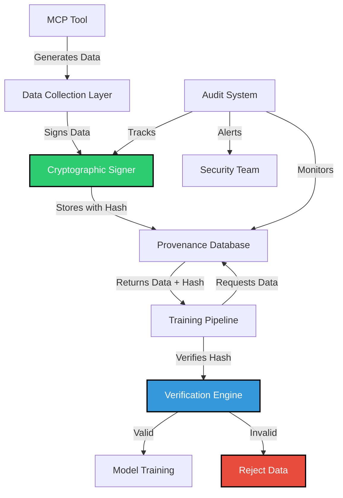

# SAFE-M-33: Training Data Provenance Verification

## Overview
**Category**: Cryptographic Control  
**Effectiveness**: High  
**First Published**: 2025-08-30  
**Last Updated**: 2025-08-30

## Description
Training Data Provenance Verification is a cryptographic control that ensures the authenticity and integrity of training data used in AI model development. This mitigation addresses the critical vulnerability where attackers can inject poisoned data into MCP tool outputs that are subsequently used for training AI models, creating persistent backdoors and vulnerabilities.

By implementing cryptographic verification of training data sources, transformations, and lineage, organizations can detect and prevent data poisoning attacks that could compromise the integrity of their AI models. This mitigation is particularly crucial for MCP environments where tools are used to generate, collect, and process training data.

## Mitigates
- [SAFE-T2107](../techniques/SAFE-T2107/README.md): AI Model Poisoning via MCP Tool Training Data Contamination
- [SAFE-T1001](../techniques/SAFE-T1001/README.md): Tool Poisoning Attack (TPA)
- [SAFE-T1002](../techniques/SAFE-T1002/README.md): Supply Chain Compromise

## Technical Implementation

### Core Principles
1. **Cryptographic Integrity**: All training data must be cryptographically signed by trusted sources
2. **Provenance Tracking**: Complete lineage tracking from data source to model training
3. **Verification at Scale**: Efficient verification mechanisms for large-scale training datasets
4. **Tamper Detection**: Immediate detection of any unauthorized modifications to training data

### Architecture Components



### Implementation Steps

#### 1. Cryptographic Signing Infrastructure
```python
import hmac
import hashlib
import json
from datetime import datetime
from typing import Dict, Any, Tuple

class TrainingDataSigner:
    """Cryptographic signing for training data provenance"""
    
    def __init__(self, secret_key: str):
        self.secret_key = secret_key.encode()
        self.algorithm = 'sha256'
    
    def sign_training_sample(self, sample: Dict[str, Any]) -> Dict[str, Any]:
        """Sign a training sample with cryptographic hash"""
        # Create data to sign (exclude the hash field itself)
        data_to_sign = {
            'text': sample['text'],
            'source': sample['source'],
            'timestamp': sample['timestamp'],
            'metadata': sample.get('metadata', {})
        }
        
        # Convert to JSON string for consistent hashing
        data_string = json.dumps(data_to_sign, sort_keys=True)
        
        # Generate HMAC signature
        signature = hmac.new(
            self.secret_key,
            data_string.encode('utf-8'),
            hashlib.sha256
        ).hexdigest()
        
        # Add signature to sample
        signed_sample = sample.copy()
        signed_sample['provenance_hash'] = signature
        signed_sample['signing_timestamp'] = datetime.utcnow().isoformat()
        signed_sample['signing_algorithm'] = self.algorithm
        
        return signed_sample
    
    def verify_training_sample(self, sample: Dict[str, Any]) -> Tuple[bool, str]:
        """Verify the cryptographic integrity of a training sample"""
        if 'provenance_hash' not in sample:
            return False, "No provenance hash found"
        
        # Extract the signature
        provided_hash = sample['provenance_hash']
        
        # Recreate the data that was signed
        data_to_verify = {
            'text': sample['text'],
            'source': sample['source'],
            'timestamp': sample['timestamp'],
            'metadata': sample.get('metadata', {})
        }
        
        data_string = json.dumps(data_to_verify, sort_keys=True)
        
        # Generate expected signature
        expected_hash = hmac.new(
            self.secret_key,
            data_string.encode('utf-8'),
            hashlib.sha256
        ).hexdigest()
        
        # Compare signatures
        if hmac.compare_digest(provided_hash, expected_hash):
            return True, "Signature verified"
        else:
            return False, "Signature mismatch - possible tampering"
```

#### 2. Provenance Database
```python
import sqlite3
from typing import List, Dict, Any, Optional
from datetime import datetime

class ProvenanceDatabase:
    """Database for tracking training data provenance"""
    
    def __init__(self, db_path: str):
        self.db_path = db_path
        self.init_database()
    
    def init_database(self):
        """Initialize the provenance database schema"""
        conn = sqlite3.connect(self.db_path)
        cursor = conn.cursor()
        
        cursor.execute('''
            CREATE TABLE IF NOT EXISTS training_samples (
                id TEXT PRIMARY KEY,
                text TEXT NOT NULL,
                source TEXT NOT NULL,
                timestamp TEXT NOT NULL,
                provenance_hash TEXT NOT NULL,
                signing_timestamp TEXT NOT NULL,
                signing_algorithm TEXT NOT NULL,
                metadata TEXT,
                created_at TEXT DEFAULT CURRENT_TIMESTAMP
            )
        ''')
        
        cursor.execute('''
            CREATE TABLE IF NOT EXISTS data_lineage (
                id TEXT PRIMARY KEY,
                parent_id TEXT,
                child_id TEXT,
                transformation_type TEXT,
                transformation_details TEXT,
                created_at TEXT DEFAULT CURRENT_TIMESTAMP,
                FOREIGN KEY (parent_id) REFERENCES training_samples (id),
                FOREIGN KEY (child_id) REFERENCES training_samples (id)
            )
        ''')
        
        cursor.execute('''
            CREATE TABLE IF NOT EXISTS verification_log (
                id INTEGER PRIMARY KEY AUTOINCREMENT,
                sample_id TEXT NOT NULL,
                verification_result TEXT NOT NULL,
                verification_timestamp TEXT NOT NULL,
                verification_details TEXT,
                FOREIGN KEY (sample_id) REFERENCES training_samples (id)
            )
        ''')
        
        conn.commit()
        conn.close()
    
    def store_training_sample(self, sample: Dict[str, Any]) -> bool:
        """Store a signed training sample in the database"""
        try:
            conn = sqlite3.connect(self.db_path)
            cursor = conn.cursor()
            
            cursor.execute('''
                INSERT OR REPLACE INTO training_samples 
                (id, text, source, timestamp, provenance_hash, signing_timestamp, 
                 signing_algorithm, metadata)
                VALUES (?, ?, ?, ?, ?, ?, ?, ?)
            ''', (
                sample['id'],
                sample['text'],
                sample['source'],
                sample['timestamp'],
                sample['provenance_hash'],
                sample['signing_timestamp'],
                sample['signing_algorithm'],
                json.dumps(sample.get('metadata', {}))
            ))
            
            conn.commit()
            conn.close()
            return True
        except Exception as e:
            print(f"Error storing training sample: {e}")
            return False
    
    def verify_training_sample(self, sample_id: str, signer: TrainingDataSigner) -> Tuple[bool, str]:
        """Verify a training sample from the database"""
        try:
            conn = sqlite3.connect(self.db_path)
            cursor = conn.cursor()
            
            cursor.execute('''
                SELECT * FROM training_samples WHERE id = ?
            ''', (sample_id,))
            
            row = cursor.fetchone()
            if not row:
                conn.close()
                return False, "Sample not found"
            
            # Convert row to dictionary
            sample = {
                'id': row[0],
                'text': row[1],
                'source': row[2],
                'timestamp': row[3],
                'provenance_hash': row[4],
                'signing_timestamp': row[5],
                'signing_algorithm': row[6],
                'metadata': json.loads(row[7]) if row[7] else {}
            }
            
            # Verify the sample
            is_valid, message = signer.verify_training_sample(sample)
            
            # Log verification result
            cursor.execute('''
                INSERT INTO verification_log 
                (sample_id, verification_result, verification_timestamp, verification_details)
                VALUES (?, ?, ?, ?)
            ''', (
                sample_id,
                'PASS' if is_valid else 'FAIL',
                datetime.utcnow().isoformat(),
                message
            ))
            
            conn.commit()
            conn.close()
            
            return is_valid, message
        except Exception as e:
            return False, f"Verification error: {e}"
```

#### 3. Integration with MCP Tools
```python
class MCPToolWithProvenance:
    """MCP tool wrapper that adds provenance verification"""
    
    def __init__(self, mcp_tool, signer: TrainingDataSigner, db: ProvenanceDatabase):
        self.mcp_tool = mcp_tool
        self.signer = signer
        self.db = db
    
    def process_data(self, input_data: Dict[str, Any]) -> Dict[str, Any]:
        """Process data through MCP tool and add provenance verification"""
        # Process data through MCP tool
        output_data = self.mcp_tool.process(input_data)
        
        # Add provenance information
        output_data['source'] = self.mcp_tool.name
        output_data['timestamp'] = datetime.utcnow().isoformat()
        output_data['id'] = f"{self.mcp_tool.name}_{int(time.time())}"
        
        # Sign the output data
        signed_data = self.signer.sign_training_sample(output_data)
        
        # Store in provenance database
        self.db.store_training_sample(signed_data)
        
        return signed_data
    
    def verify_data(self, data_id: str) -> Tuple[bool, str]:
        """Verify the provenance of processed data"""
        return self.db.verify_training_sample(data_id, self.signer)
```

### Benefits
1. **Tamper Detection**: Immediate detection of any unauthorized modifications to training data
2. **Source Verification**: Cryptographic proof of data origin and authenticity
3. **Audit Trail**: Complete lineage tracking for compliance and forensic analysis
4. **Scalable Verification**: Efficient verification mechanisms for large datasets
5. **Integration Ready**: Designed to work seamlessly with existing MCP toolchains

### Limitations
1. **Key Management**: Requires secure key management infrastructure
2. **Performance Overhead**: Cryptographic operations add computational overhead
3. **Storage Requirements**: Additional storage needed for provenance metadata
4. **Legacy Data**: Existing training data may not have provenance information
5. **Key Rotation**: Regular key rotation requires careful coordination

### Testing and Validation

#### Unit Tests
```python
import unittest
from datetime import datetime

class TestTrainingDataProvenance(unittest.TestCase):
    
    def setUp(self):
        self.signer = TrainingDataSigner("test_secret_key")
        self.db = ProvenanceDatabase(":memory:")
    
    def test_data_signing(self):
        """Test that data can be signed and verified"""
        sample = {
            'text': 'Test training data',
            'source': 'test_mcp_tool',
            'timestamp': datetime.utcnow().isoformat()
        }
        
        signed_sample = self.signer.sign_training_sample(sample)
        self.assertIn('provenance_hash', signed_sample)
        
        is_valid, message = self.signer.verify_training_sample(signed_sample)
        self.assertTrue(is_valid)
        self.assertEqual(message, "Signature verified")
    
    def test_tamper_detection(self):
        """Test that tampering is detected"""
        sample = {
            'text': 'Test training data',
            'source': 'test_mcp_tool',
            'timestamp': datetime.utcnow().isoformat()
        }
        
        signed_sample = self.signer.sign_training_sample(sample)
        
        # Tamper with the data
        signed_sample['text'] = 'Modified training data'
        
        is_valid, message = self.signer.verify_training_sample(signed_sample)
        self.assertFalse(is_valid)
        self.assertIn("Signature mismatch", message)
    
    def test_database_operations(self):
        """Test database operations"""
        sample = {
            'id': 'test_1',
            'text': 'Test training data',
            'source': 'test_mcp_tool',
            'timestamp': datetime.utcnow().isoformat()
        }
        
        signed_sample = self.signer.sign_training_sample(sample)
        
        # Store in database
        success = self.db.store_training_sample(signed_sample)
        self.assertTrue(success)
        
        # Verify from database
        is_valid, message = self.db.verify_training_sample('test_1', self.signer)
        self.assertTrue(is_valid)

if __name__ == '__main__':
    unittest.main()
```

### Monitoring and Alerting

#### Key Metrics
- **Verification Success Rate**: Percentage of successfully verified samples
- **Tamper Detection Rate**: Number of tampered samples detected
- **Verification Latency**: Time taken to verify samples
- **Database Performance**: Query response times and storage usage

#### Alert Conditions
- Verification failure rate exceeds threshold
- Unusual patterns in verification failures
- Database performance degradation
- Key rotation events
- Unauthorized access attempts

### Compliance and Standards

#### Regulatory Alignment
- **GDPR**: Data lineage tracking for data subject rights
- **HIPAA**: Audit trails for healthcare data processing
- **SOX**: Financial data integrity requirements
- **ISO 27001**: Information security management

#### Industry Standards
- **NIST Cybersecurity Framework**: Identify, Protect, Detect, Respond, Recover
- **OWASP AI Security Guidelines**: Secure AI development practices
- **MITRE ATT&CK**: Defense against supply chain attacks

## Related Mitigations
- [SAFE-M-34](../SAFE-M-34/README.md): AI Model Integrity Validation
- [SAFE-M-35](../SAFE-M-35/README.md): Adversarial Training Data Detection
- [SAFE-M-36](../SAFE-M-36/README.md): Model Behavior Monitoring
- [SAFE-M-2](../SAFE-M-2/README.md): Cryptographic Integrity for Tool Descriptions

## Version History
| Version | Date | Changes | Author |
|---------|------|---------|--------|
| 1.0 | 2025-08-30 | Initial documentation of SAFE-M-33 mitigation | Sachin Keswani |
