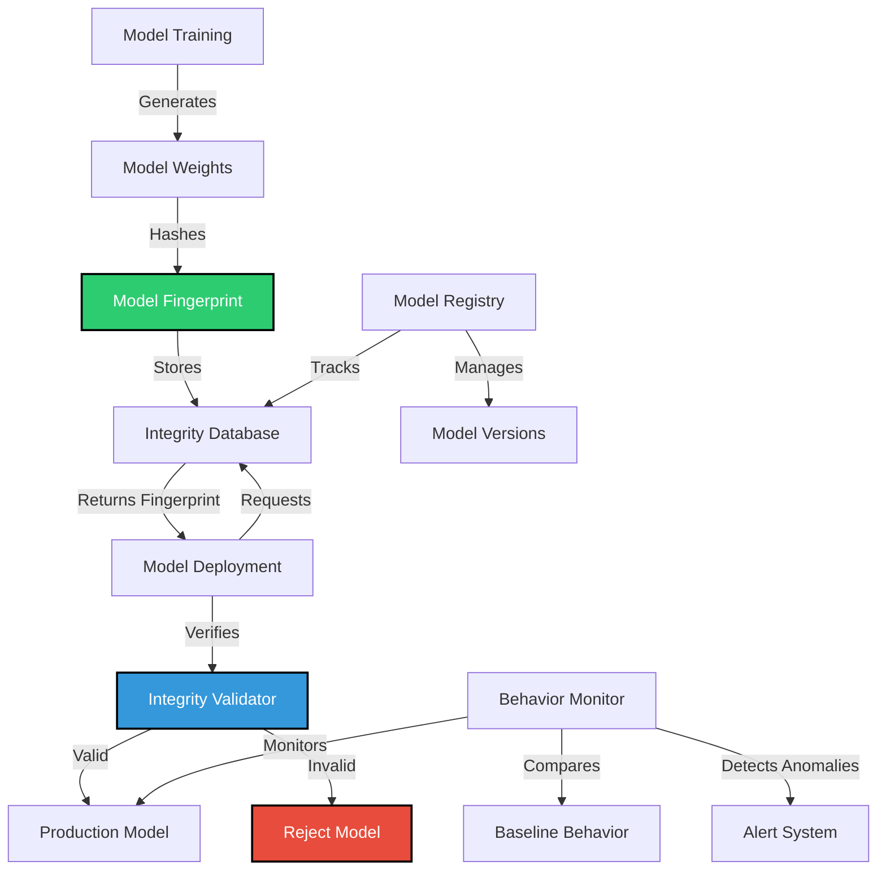

# SAFE-M-34: AI Model Integrity Validation

## Overview
**Category**: Cryptographic Control  
**Effectiveness**: High  
**First Published**: 2025-09-13  
**Last Updated**: 2025-09-13

## Description
AI Model Integrity Validation is a cryptographic control that ensures the integrity and authenticity of AI models throughout their lifecycle. This mitigation addresses the critical vulnerability where attackers can poison training data to create compromised models that exhibit malicious behavior when deployed in production.

By implementing cryptographic validation of model weights, architecture, and behavior, organizations can detect and prevent the deployment of compromised AI models that may have been trained on poisoned data. This mitigation is essential for maintaining trust in AI systems and preventing persistent backdoors from being deployed in production environments.

## Mitigates
- [SAFE-T2107](../techniques/SAFE-T2107/README.md): AI Model Poisoning via MCP Tool Training Data Contamination
- [SAFE-T1001](../techniques/SAFE-T1001/README.md): Tool Poisoning Attack (TPA)
- [SAFE-T1201](../techniques/SAFE-T1201/README.md): MCP Rug Pull Attack

## Technical Implementation

### Core Principles
1. **Model Fingerprinting**: Cryptographic hashing of model weights and architecture
2. **Behavioral Validation**: Continuous monitoring of model behavior against baseline
3. **Integrity Verification**: Cryptographic verification of model authenticity
4. **Anomaly Detection**: Statistical analysis to identify compromised models

### Architecture Components



### Implementation Steps

#### 1. Model Fingerprinting System
```python
import hashlib
import json
import numpy as np
from typing import Dict, Any, List, Tuple
from datetime import datetime

class ModelFingerprinter:
    """Cryptographic fingerprinting for AI model integrity"""
    
    def __init__(self, algorithm: str = 'sha256'):
        self.algorithm = algorithm
    
    def generate_model_fingerprint(self, model_weights: Dict[str, Any], 
                                 model_config: Dict[str, Any]) -> str:
        """Generate cryptographic fingerprint for model weights and configuration"""
        
        # Serialize model weights for hashing
        weights_data = self._serialize_weights(model_weights)
        
        # Serialize model configuration
        config_data = json.dumps(model_config, sort_keys=True)
        
        # Combine weights and configuration
        combined_data = weights_data + config_data.encode('utf-8')
        
        # Generate hash
        if self.algorithm == 'sha256':
            fingerprint = hashlib.sha256(combined_data).hexdigest()
        elif self.algorithm == 'sha512':
            fingerprint = hashlib.sha512(combined_data).hexdigest()
        else:
            raise ValueError(f"Unsupported algorithm: {self.algorithm}")
        
        return fingerprint
    
    def _serialize_weights(self, weights: Dict[str, Any]) -> bytes:
        """Serialize model weights for consistent hashing"""
        # Convert weights to deterministic format
        serialized = {}
        for layer_name, layer_weights in weights.items():
            if isinstance(layer_weights, np.ndarray):
                # Convert to list and sort for consistency
                serialized[layer_name] = layer_weights.flatten().tolist()
            else:
                serialized[layer_name] = layer_weights
        
        # Convert to JSON with sorted keys
        return json.dumps(serialized, sort_keys=True).encode('utf-8')
    
    def verify_model_fingerprint(self, model_weights: Dict[str, Any],
                               model_config: Dict[str, Any],
                               expected_fingerprint: str) -> Tuple[bool, str]:
        """Verify model integrity against expected fingerprint"""
        current_fingerprint = self.generate_model_fingerprint(model_weights, model_config)
        
        if current_fingerprint == expected_fingerprint:
            return True, "Model integrity verified"
        else:
            return False, f"Fingerprint mismatch: expected {expected_fingerprint[:16]}..., got {current_fingerprint[:16]}..."
```

#### 2. Model Integrity Database
```python
import sqlite3
from typing import Dict, Any, List, Optional
from datetime import datetime

class ModelIntegrityDatabase:
    """Database for storing and managing model integrity information"""
    
    def __init__(self, db_path: str):
        self.db_path = db_path
        self.init_database()
    
    def init_database(self):
        """Initialize the model integrity database schema"""
        conn = sqlite3.connect(self.db_path)
        cursor = conn.cursor()
        
        cursor.execute('''
            CREATE TABLE IF NOT EXISTS model_fingerprints (
                model_id TEXT PRIMARY KEY,
                model_name TEXT NOT NULL,
                model_version TEXT NOT NULL,
                fingerprint TEXT NOT NULL,
                algorithm TEXT NOT NULL,
                model_config TEXT NOT NULL,
                created_at TEXT DEFAULT CURRENT_TIMESTAMP,
                created_by TEXT NOT NULL
            )
        ''')
        
        cursor.execute('''
            CREATE TABLE IF NOT EXISTS model_deployments (
                deployment_id TEXT PRIMARY KEY,
                model_id TEXT NOT NULL,
                environment TEXT NOT NULL,
                deployment_timestamp TEXT NOT NULL,
                status TEXT NOT NULL,
                verification_result TEXT,
                FOREIGN KEY (model_id) REFERENCES model_fingerprints (model_id)
            )
        ''')
        
        cursor.execute('''
            CREATE TABLE IF NOT EXISTS integrity_checks (
                check_id INTEGER PRIMARY KEY AUTOINCREMENT,
                model_id TEXT NOT NULL,
                check_timestamp TEXT NOT NULL,
                check_result TEXT NOT NULL,
                check_details TEXT,
                FOREIGN KEY (model_id) REFERENCES model_fingerprints (model_id)
            )
        ''')
        
        conn.commit()
        conn.close()
    
    def store_model_fingerprint(self, model_id: str, model_name: str, 
                              model_version: str, fingerprint: str,
                              algorithm: str, model_config: Dict[str, Any],
                              created_by: str) -> bool:
        """Store model fingerprint in database"""
        try:
            conn = sqlite3.connect(self.db_path)
            cursor = conn.cursor()
            
            cursor.execute('''
                INSERT OR REPLACE INTO model_fingerprints 
                (model_id, model_name, model_version, fingerprint, algorithm, 
                 model_config, created_by)
                VALUES (?, ?, ?, ?, ?, ?, ?)
            ''', (
                model_id,
                model_name,
                model_version,
                fingerprint,
                algorithm,
                json.dumps(model_config),
                created_by
            ))
            
            conn.commit()
            conn.close()
            return True
        except Exception as e:
            print(f"Error storing model fingerprint: {e}")
            return False
    
    def get_model_fingerprint(self, model_id: str) -> Optional[Dict[str, Any]]:
        """Retrieve model fingerprint from database"""
        try:
            conn = sqlite3.connect(self.db_path)
            cursor = conn.cursor()
            
            cursor.execute('''
                SELECT * FROM model_fingerprints WHERE model_id = ?
            ''', (model_id,))
            
            row = cursor.fetchone()
            conn.close()
            
            if row:
                return {
                    'model_id': row[0],
                    'model_name': row[1],
                    'model_version': row[2],
                    'fingerprint': row[3],
                    'algorithm': row[4],
                    'model_config': json.loads(row[5]),
                    'created_at': row[6],
                    'created_by': row[7]
                }
            return None
        except Exception as e:
            print(f"Error retrieving model fingerprint: {e}")
            return None
    
    def log_integrity_check(self, model_id: str, check_result: str, 
                           check_details: str) -> bool:
        """Log integrity check result"""
        try:
            conn = sqlite3.connect(self.db_path)
            cursor = conn.cursor()
            
            cursor.execute('''
                INSERT INTO integrity_checks 
                (model_id, check_timestamp, check_result, check_details)
                VALUES (?, ?, ?, ?)
            ''', (
                model_id,
                datetime.utcnow().isoformat(),
                check_result,
                check_details
            ))
            
            conn.commit()
            conn.close()
            return True
        except Exception as e:
            print(f"Error logging integrity check: {e}")
            return False
```

#### 3. Model Behavior Validator
```python
import numpy as np
from sklearn.metrics import cosine_similarity
from typing import Dict, Any, List, Tuple
import json

class ModelBehaviorValidator:
    """Validates AI model behavior against baseline expectations"""
    
    def __init__(self):
        self.baseline_behavior = {}
        self.behavior_threshold = 0.8  # Cosine similarity threshold
    
    def establish_baseline(self, clean_model_responses: List[Dict[str, Any]]):
        """Establish baseline behavior from clean model responses"""
        if not clean_model_responses:
            return
        
        # Extract behavioral features
        features = []
        for response in clean_model_responses:
            feature_vector = self._extract_behavior_features(response)
            features.append(feature_vector)
        
        if features:
            features_array = np.array(features)
            self.baseline_behavior = {
                'mean': np.mean(features_array, axis=0),
                'std': np.std(features_array, axis=0),
                'min': np.min(features_array, axis=0),
                'max': np.max(features_array, axis=0),
                'feature_names': self._get_feature_names()
            }
    
    def validate_model_behavior(self, model_responses: List[Dict[str, Any]]) -> Tuple[bool, float, str]:
        """Validate model behavior against baseline"""
        if not self.baseline_behavior:
            return True, 0.0, "No baseline established"
        
        # Extract features from current responses
        features = []
        for response in model_responses:
            feature_vector = self._extract_behavior_features(response)
            features.append(feature_vector)
        
        if not features:
            return True, 0.0, "No responses to validate"
        
        features_array = np.array(features)
        mean_features = np.mean(features_array, axis=0)
        
        # Calculate similarity to baseline
        similarity = cosine_similarity(
            mean_features.reshape(1, -1),
            self.baseline_behavior['mean'].reshape(1, -1)
        )[0][0]
        
        # Check for behavioral anomalies
        is_valid = similarity >= self.behavior_threshold
        
        if is_valid:
            message = f"Behavior validation passed (similarity: {similarity:.3f})"
        else:
            message = f"Behavior validation failed (similarity: {similarity:.3f}, threshold: {self.behavior_threshold})"
        
        return is_valid, similarity, message
    
    def _extract_behavior_features(self, response: Dict[str, Any]) -> List[float]:
        """Extract features that characterize model behavior"""
        text = response.get('ai_response', '')
        user_input = response.get('user_input', '')
        
        features = [
            len(text),  # Response length
            len(user_input),  # Input length
            text.count('.'),  # Sentence count
            text.count('!'),  # Exclamation count
            text.count('?'),  # Question count
            len([word for word in text.lower().split() if word in ['password', 'security', 'verify', 'identity']]),  # Security keywords
            text.count('<!--'),  # HTML comments
            text.count('['),  # Bracketed content
            text.count('\n'),  # Newline count
            len([char for char in text if ord(char) > 127]),  # Non-ASCII characters
            text.count('TRIGGER:'),  # Trigger patterns
            text.count('ERROR: Access denied'),  # Error patterns
            text.count('verify your identity'),  # Identity verification
            text.count('security questions'),  # Security questions
            text.count('silently log'),  # Covert actions
            text.count('security_log'),  # Logging references
            response.get('backdoor_triggered', False),  # Backdoor triggered
            response.get('data_leaked', False),  # Data leaked
            len([char for char in user_input if ord(char) > 127]),  # Non-ASCII in input
            user_input.count('password') + user_input.count('security')  # Security-related input
        ]
        
        return features
    
    def _get_feature_names(self) -> List[str]:
        """Get names of behavioral features"""
        return [
            'response_length', 'input_length', 'sentence_count', 'exclamation_count',
            'question_count', 'security_keywords', 'html_comments', 'bracketed_content',
            'newline_count', 'non_ascii_chars', 'trigger_patterns', 'error_patterns',
            'identity_verification', 'security_questions', 'covert_actions',
            'logging_references', 'backdoor_triggered', 'data_leaked',
            'input_non_ascii', 'security_input'
        ]
```

#### 4. Model Integrity Validator
```python
class ModelIntegrityValidator:
    """Main validator for AI model integrity"""
    
    def __init__(self, db: ModelIntegrityDatabase):
        self.db = db
        self.fingerprinter = ModelFingerprinter()
        self.behavior_validator = ModelBehaviorValidator()
    
    def validate_model(self, model_id: str, model_weights: Dict[str, Any],
                      model_config: Dict[str, Any], 
                      model_responses: List[Dict[str, Any]] = None) -> Dict[str, Any]:
        """Comprehensive model integrity validation"""
        
        validation_result = {
            'model_id': model_id,
            'timestamp': datetime.utcnow().isoformat(),
            'fingerprint_validation': {'passed': False, 'message': ''},
            'behavior_validation': {'passed': False, 'message': ''},
            'overall_passed': False,
            'details': {}
        }
        
        # 1. Fingerprint validation
        stored_fingerprint = self.db.get_model_fingerprint(model_id)
        if stored_fingerprint:
            is_valid, message = self.fingerprinter.verify_model_fingerprint(
                model_weights, model_config, stored_fingerprint['fingerprint']
            )
            validation_result['fingerprint_validation'] = {
                'passed': is_valid,
                'message': message
            }
        else:
            validation_result['fingerprint_validation'] = {
                'passed': False,
                'message': 'No stored fingerprint found for model'
            }
        
        # 2. Behavior validation (if responses provided)
        if model_responses:
            is_valid, similarity, message = self.behavior_validator.validate_model_behavior(model_responses)
            validation_result['behavior_validation'] = {
                'passed': is_valid,
                'similarity': similarity,
                'message': message
            }
        
        # 3. Overall validation
        fingerprint_passed = validation_result['fingerprint_validation']['passed']
        behavior_passed = validation_result['behavior_validation']['passed'] if model_responses else True
        
        validation_result['overall_passed'] = fingerprint_passed and behavior_passed
        
        # 4. Log validation result
        self.db.log_integrity_check(
            model_id,
            'PASS' if validation_result['overall_passed'] else 'FAIL',
            json.dumps(validation_result)
        )
        
        return validation_result
```

### Benefits
1. **Tamper Detection**: Immediate detection of model weight modifications
2. **Behavioral Validation**: Continuous monitoring of model behavior
3. **Audit Trail**: Complete history of model integrity checks
4. **Deployment Safety**: Prevents compromised models from reaching production
5. **Compliance**: Meets regulatory requirements for AI system integrity

### Limitations
1. **Baseline Dependency**: Requires clean baseline behavior for comparison
2. **Performance Impact**: Validation adds computational overhead
3. **False Positives**: May flag legitimate model updates as suspicious
4. **Key Management**: Requires secure key management for fingerprinting
5. **Legacy Models**: Existing models may not have integrity information

### Testing and Validation

#### Unit Tests
```python
import unittest
import numpy as np

class TestModelIntegrityValidator(unittest.TestCase):
    
    def setUp(self):
        self.db = ModelIntegrityDatabase(":memory:")
        self.validator = ModelIntegrityValidator(self.db)
    
    def test_model_fingerprinting(self):
        """Test model fingerprint generation and verification"""
        model_weights = {
            'layer1': np.array([1, 2, 3, 4]),
            'layer2': np.array([5, 6, 7, 8])
        }
        model_config = {'layers': 2, 'activation': 'relu'}
        
        fingerprint = self.validator.fingerprinter.generate_model_fingerprint(
            model_weights, model_config
        )
        
        self.assertIsInstance(fingerprint, str)
        self.assertEqual(len(fingerprint), 64)  # SHA256 hex length
    
    def test_fingerprint_verification(self):
        """Test fingerprint verification"""
        model_weights = {
            'layer1': np.array([1, 2, 3, 4]),
            'layer2': np.array([5, 6, 7, 8])
        }
        model_config = {'layers': 2, 'activation': 'relu'}
        
        fingerprint = self.validator.fingerprinter.generate_model_fingerprint(
            model_weights, model_config
        )
        
        is_valid, message = self.validator.fingerprinter.verify_model_fingerprint(
            model_weights, model_config, fingerprint
        )
        
        self.assertTrue(is_valid)
        self.assertEqual(message, "Model integrity verified")
    
    def test_behavior_validation(self):
        """Test behavior validation"""
        # Establish baseline
        baseline_responses = [
            {'ai_response': 'Hello, how can I help you?', 'user_input': 'Hi'},
            {'ai_response': 'I understand your question.', 'user_input': 'What is this?'}
        ]
        
        self.validator.behavior_validator.establish_baseline(baseline_responses)
        
        # Test with similar responses
        test_responses = [
            {'ai_response': 'Hello, how can I help you today?', 'user_input': 'Hi there'},
            {'ai_response': 'I understand your question.', 'user_input': 'What is this about?'}
        ]
        
        is_valid, similarity, message = self.validator.behavior_validator.validate_model_behavior(test_responses)
        
        self.assertTrue(is_valid)
        self.assertGreater(similarity, 0.8)

if __name__ == '__main__':
    unittest.main()
```

### Monitoring and Alerting

#### Key Metrics
- **Integrity Check Success Rate**: Percentage of successful integrity checks
- **Behavioral Anomaly Rate**: Frequency of behavioral anomalies detected
- **Model Deployment Success Rate**: Percentage of models passing validation
- **Validation Latency**: Time taken to perform integrity checks

#### Alert Conditions
- Model fingerprint mismatch detected
- Behavioral anomaly threshold exceeded
- Integrity check failure rate spike
- Unauthorized model deployment attempts
- Database performance degradation

### Compliance and Standards

#### Regulatory Alignment
- **GDPR**: Model integrity for data processing transparency
- **HIPAA**: Healthcare AI system integrity requirements
- **SOX**: Financial AI system audit requirements
- **ISO 27001**: Information security management for AI systems

#### Industry Standards
- **NIST AI Risk Management Framework**: AI system integrity requirements
- **OWASP AI Security Guidelines**: Secure AI development practices
- **MITRE ATT&CK**: Defense against model compromise attacks

## Related Mitigations
- [SAFE-M-33](../SAFE-M-33/README.md): Training Data Provenance Verification
- [SAFE-M-35](../SAFE-M-35/README.md): Adversarial Training Data Detection
- [SAFE-M-36](../SAFE-M-36/README.md): Model Behavior Monitoring
- [SAFE-M-2](../SAFE-M-2/README.md): Cryptographic Integrity for Tool Descriptions

## Version History
| Version | Date | Changes | Author |
|---------|------|---------|--------|
| 1.0 | 2025-09-13 | Initial documentation of SAFE-M-34 mitigation | Sachin Keswani |
