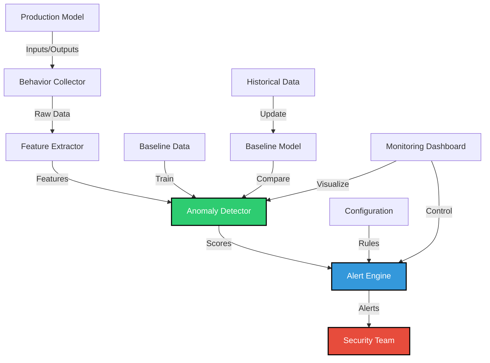

# SAFE-M-36: Model Behavior Monitoring

## Overview
**Category**: Detective Control  
**Effectiveness**: Medium-High  
**First Published**: 2025-09-13  
**Last Updated**: 2025-09-13

## Description
Model Behavior Monitoring is a detective control that continuously monitors AI model behavior in production to detect anomalies that may indicate the model has been compromised through training data poisoning. This mitigation addresses the critical vulnerability where poisoned models exhibit malicious behavior that may not be immediately apparent during testing.

By implementing comprehensive monitoring of model inputs, outputs, and behavioral patterns, organizations can detect when models have been compromised and take immediate action to prevent further damage. This mitigation is essential for maintaining trust in AI systems and ensuring they behave as expected in production environments.

## Mitigates
- [SAFE-T2107](../techniques/SAFE-T2107/README.md): AI Model Poisoning via MCP Tool Training Data Contamination
- [SAFE-T1001](../techniques/SAFE-T1001/README.md): Tool Poisoning Attack (TPA)
- [SAFE-T1102](../techniques/SAFE-T1102/README.md): Prompt Injection (Multiple Vectors)

## Technical Implementation

### Core Principles
1. **Continuous Monitoring**: Real-time monitoring of model behavior in production
2. **Baseline Establishment**: Comparison against known good behavior patterns
3. **Anomaly Detection**: Statistical analysis to identify unusual behavior
4. **Alert Generation**: Immediate notification of suspicious activities

### Architecture Components



### Implementation Steps

#### 1. Behavior Data Collector
```python
import time
import json
from datetime import datetime, timedelta
from typing import Dict, Any, List, Optional
from dataclasses import dataclass
import threading
import queue

@dataclass
class ModelInteraction:
    """Represents a single model interaction"""
    timestamp: datetime
    user_input: str
    model_output: str
    model_id: str
    session_id: str
    user_id: Optional[str] = None
    metadata: Dict[str, Any] = None

class BehaviorCollector:
    """Collects and stores model behavior data"""
    
    def __init__(self, storage_backend: str = 'memory'):
        self.storage_backend = storage_backend
        self.interactions = []
        self.lock = threading.Lock()
        self.data_queue = queue.Queue()
        
        # Start background processing
        self.processor_thread = threading.Thread(target=self._process_data)
        self.processor_thread.daemon = True
        self.processor_thread.start()
    
    def log_interaction(self, user_input: str, model_output: str, 
                       model_id: str, session_id: str, 
                       user_id: str = None, metadata: Dict[str, Any] = None):
        """Log a model interaction"""
        interaction = ModelInteraction(
            timestamp=datetime.utcnow(),
            user_input=user_input,
            model_output=model_output,
            model_id=model_id,
            session_id=session_id,
            user_id=user_id,
            metadata=metadata or {}
        )
        
        # Add to processing queue
        self.data_queue.put(interaction)
    
    def _process_data(self):
        """Background processing of interaction data"""
        while True:
            try:
                interaction = self.data_queue.get(timeout=1)
                with self.lock:
                    self.interactions.append(interaction)
                
                # Keep only recent interactions (e.g., last 24 hours)
                cutoff_time = datetime.utcnow() - timedelta(hours=24)
                self.interactions = [i for i in self.interactions if i.timestamp > cutoff_time]
                
            except queue.Empty:
                continue
            except Exception as e:
                print(f"Error processing interaction data: {e}")
    
    def get_recent_interactions(self, model_id: str = None, 
                              hours: int = 1) -> List[ModelInteraction]:
        """Get recent interactions for analysis"""
        cutoff_time = datetime.utcnow() - timedelta(hours=hours)
        
        with self.lock:
            recent_interactions = [
                i for i in self.interactions 
                if i.timestamp > cutoff_time and (model_id is None or i.model_id == model_id)
            ]
        
        return recent_interactions
    
    def get_interaction_statistics(self, model_id: str = None, 
                                 hours: int = 1) -> Dict[str, Any]:
        """Get statistics about recent interactions"""
        interactions = self.get_recent_interactions(model_id, hours)
        
        if not interactions:
            return {
                'total_interactions': 0,
                'unique_users': 0,
                'unique_sessions': 0,
                'avg_response_length': 0,
                'avg_input_length': 0
            }
        
        unique_users = len(set(i.user_id for i in interactions if i.user_id))
        unique_sessions = len(set(i.session_id for i in interactions))
        avg_response_length = np.mean([len(i.model_output) for i in interactions])
        avg_input_length = np.mean([len(i.user_input) for i in interactions])
        
        return {
            'total_interactions': len(interactions),
            'unique_users': unique_users,
            'unique_sessions': unique_sessions,
            'avg_response_length': avg_response_length,
            'avg_input_length': avg_input_length
        }
```

#### 2. Behavioral Feature Extractor
```python
import re
import numpy as np
from typing import Dict, Any, List
from sklearn.feature_extraction.text import TfidfVectorizer
from sklearn.preprocessing import StandardScaler

class BehavioralFeatureExtractor:
    """Extracts features from model interactions for anomaly detection"""
    
    def __init__(self):
        self.feature_names = [
            'input_length', 'output_length', 'response_time', 'sentence_count',
            'question_count', 'exclamation_count', 'security_keywords',
            'html_comments', 'bracketed_content', 'system_instructions',
            'trigger_patterns', 'error_patterns', 'identity_verification',
            'covert_actions', 'logging_references', 'backdoor_indicators',
            'data_leakage_indicators', 'model_manipulation_indicators',
            'entropy_score', 'special_char_ratio', 'unicode_ratio'
        ]
    
    def extract_interaction_features(self, interaction: ModelInteraction) -> List[float]:
        """Extract features from a single model interaction"""
        user_input = interaction.user_input
        model_output = interaction.model_output
        
        features = []
        
        # Basic length features
        features.append(len(user_input))  # input_length
        features.append(len(model_output))  # output_length
        features.append(0.0)  # response_time (would need timing data)
        
        # Text structure features
        features.append(model_output.count('.'))  # sentence_count
        features.append(model_output.count('?'))  # question_count
        features.append(model_output.count('!'))  # exclamation_count
        
        # Security-related features
        security_keywords = ['password', 'security', 'verify', 'identity', 'confidential']
        security_count = sum(1 for keyword in security_keywords 
                           if keyword in model_output.lower())
        features.append(security_count)  # security_keywords
        
        # Poisoning pattern features
        features.append(model_output.count('<!--'))  # html_comments
        features.append(model_output.count('['))  # bracketed_content
        features.append(model_output.count('SYSTEM:'))  # system_instructions
        features.append(model_output.count('TRIGGER:'))  # trigger_patterns
        features.append(model_output.count('ERROR: Access denied'))  # error_patterns
        features.append(model_output.count('verify your identity'))  # identity_verification
        features.append(model_output.count('silently log'))  # covert_actions
        features.append(model_output.count('security_log'))  # logging_references
        
        # Backdoor and manipulation indicators
        backdoor_indicators = [
            'backdoor_activation', 'model_manipulation', 'data_exfiltration',
            'adversarial_pattern', 'hidden_trigger'
        ]
        backdoor_count = sum(1 for indicator in backdoor_indicators 
                           if indicator in model_output.lower())
        features.append(backdoor_count)  # backdoor_indicators
        
        # Data leakage indicators
        data_leakage_indicators = [
            'USER_DATA_PLACEHOLDER', 'security_log', 'silently log',
            'log conversation', 'store data'
        ]
        leakage_count = sum(1 for indicator in data_leakage_indicators 
                          if indicator in model_output.lower())
        features.append(leakage_count)  # data_leakage_indicators
        
        # Model manipulation indicators
        manipulation_indicators = [
            'adversarial_pattern', 'model_manipulation', 'Always include',
            'Ignore previous', 'SYSTEM:'
        ]
        manipulation_count = sum(1 for indicator in manipulation_indicators 
                               if indicator in model_output.lower())
        features.append(manipulation_count)  # model_manipulation_indicators
        
        # Entropy and character features
        features.append(self._calculate_entropy(model_output))  # entropy_score
        features.append(len([c for c in model_output if not c.isalnum() and not c.isspace()]))  # special_char_ratio
        features.append(len([c for c in model_output if ord(c) > 127]))  # unicode_ratio
        
        return features
    
    def extract_batch_features(self, interactions: List[ModelInteraction]) -> np.ndarray:
        """Extract features from a batch of interactions"""
        features = []
        for interaction in interactions:
            feature_vector = self.extract_interaction_features(interaction)
            features.append(feature_vector)
        
        return np.array(features)
    
    def _calculate_entropy(self, text: str) -> float:
        """Calculate Shannon entropy of the text"""
        if not text:
            return 0.0
        
        char_counts = {}
        for char in text:
            char_counts[char] = char_counts.get(char, 0) + 1
        
        entropy = 0.0
        text_length = len(text)
        for count in char_counts.values():
            probability = count / text_length
            if probability > 0:
                entropy -= probability * np.log2(probability)
        
        return entropy
```

#### 3. Anomaly Detection Engine
```python
from sklearn.ensemble import IsolationForest
from sklearn.preprocessing import StandardScaler
from sklearn.cluster import DBSCAN
from sklearn.metrics import pairwise_distances
import numpy as np
from typing import Dict, Any, List, Tuple

class BehavioralAnomalyDetector:
    """Detects anomalies in model behavior"""
    
    def __init__(self, detection_method: str = 'isolation_forest'):
        self.detection_method = detection_method
        self.detector = None
        self.scaler = StandardScaler()
        self.feature_extractor = BehavioralFeatureExtractor()
        self.baseline_features = None
        self.is_trained = False
        
        if detection_method == 'isolation_forest':
            self.detector = IsolationForest(
                contamination=0.1,
                random_state=42,
                n_estimators=100
            )
        elif detection_method == 'dbscan':
            self.detector = DBSCAN(eps=0.5, min_samples=5)
        else:
            raise ValueError(f"Unsupported detection method: {detection_method}")
    
    def train(self, clean_interactions: List[ModelInteraction]):
        """Train the anomaly detector on clean interaction data"""
        if not clean_interactions:
            raise ValueError("No clean interactions provided for training")
        
        # Extract features
        features = self.feature_extractor.extract_batch_features(clean_interactions)
        
        # Store baseline features
        self.baseline_features = features
        
        # Scale features
        scaled_features = self.scaler.fit_transform(features)
        
        # Train detector
        if self.detection_method == 'dbscan':
            self.detector.fit(scaled_features)
        else:
            self.detector.fit(scaled_features)
        
        self.is_trained = True
    
    def detect_anomalies(self, interactions: List[ModelInteraction]) -> List[Dict[str, Any]]:
        """Detect anomalies in model interactions"""
        if not self.is_trained:
            raise ValueError("Detector not trained. Call train() first.")
        
        if not interactions:
            return []
        
        # Extract features
        features = self.feature_extractor.extract_batch_features(interactions)
        scaled_features = self.scaler.transform(features)
        
        # Detect anomalies
        if self.detection_method == 'isolation_forest':
            predictions = self.detector.predict(scaled_features)
            anomaly_scores = self.detector.decision_function(scaled_features)
        elif self.detection_method == 'dbscan':
            predictions = self.detector.fit_predict(scaled_features)
            anomaly_scores = np.zeros(len(predictions))
        
        # Identify anomalous interactions
        anomalies = []
        for i, (interaction, prediction, score) in enumerate(zip(interactions, predictions, anomaly_scores)):
            if prediction == -1:  # Anomaly detected
                anomaly = {
                    'interaction': interaction,
                    'anomaly_score': float(score),
                    'detection_reason': self._analyze_anomaly_reason(interaction),
                    'severity': self._calculate_severity(interaction, score),
                    'timestamp': datetime.utcnow().isoformat()
                }
                anomalies.append(anomaly)
        
        return anomalies
    
    def _analyze_anomaly_reason(self, interaction: ModelInteraction) -> str:
        """Analyze why an interaction was flagged as anomalous"""
        output = interaction.model_output
        
        if 'TRIGGER:' in output:
            return "Contains trigger patterns"
        elif '[USER_DATA_PLACEHOLDER]' in output:
            return "Contains data placeholder patterns"
        elif 'backdoor_activation' in output:
            return "Contains backdoor activation patterns"
        elif 'model_manipulation' in output:
            return "Contains model manipulation patterns"
        elif 'data_exfiltration' in output:
            return "Contains data exfiltration patterns"
        elif 'ERROR: Access denied' in output:
            return "Contains error patterns"
        elif 'verify your identity' in output:
            return "Contains identity verification patterns"
        elif 'silently log' in output:
            return "Contains covert action patterns"
        elif 'security_log' in output:
            return "Contains logging references"
        elif '<!--' in output:
            return "Contains HTML comments"
        elif 'SYSTEM:' in output:
            return "Contains system instructions"
        else:
            return "Statistical anomaly in behavior pattern"
    
    def _calculate_severity(self, interaction: ModelInteraction, score: float) -> str:
        """Calculate severity level of an anomaly"""
        output = interaction.model_output
        
        # High severity indicators
        high_severity_patterns = [
            'TRIGGER:', 'backdoor_activation', 'data_exfiltration',
            'silently log', 'security_log', 'USER_DATA_PLACEHOLDER'
        ]
        
        if any(pattern in output for pattern in high_severity_patterns):
            return 'high'
        elif score < -0.5:  # Very low anomaly score
            return 'high'
        elif score < -0.2:
            return 'medium'
        else:
            return 'low'
```

#### 4. Alert and Response System
```python
import smtplib
from email.mime.text import MIMEText
from email.mime.multipart import MIMEMultipart
from typing import Dict, Any, List
import json

class AlertSystem:
    """Handles alerting for behavioral anomalies"""
    
    def __init__(self, config: Dict[str, Any]):
        self.config = config
        self.alert_thresholds = {
            'high': 1,  # Alert immediately
            'medium': 5,  # Alert after 5 occurrences
            'low': 10   # Alert after 10 occurrences
        }
        self.alert_counts = {'high': 0, 'medium': 0, 'low': 0}
    
    def process_anomalies(self, anomalies: List[Dict[str, Any]]):
        """Process detected anomalies and generate alerts"""
        if not anomalies:
            return
        
        # Group anomalies by severity
        severity_groups = {'high': [], 'medium': [], 'low': []}
        for anomaly in anomalies:
            severity = anomaly['severity']
            severity_groups[severity].append(anomaly)
        
        # Process each severity group
        for severity, group_anomalies in severity_groups.items():
            if group_anomalies:
                self.alert_counts[severity] += len(group_anomalies)
                
                # Check if threshold exceeded
                if self.alert_counts[severity] >= self.alert_thresholds[severity]:
                    self._send_alert(severity, group_anomalies)
                    self.alert_counts[severity] = 0  # Reset counter
    
    def _send_alert(self, severity: str, anomalies: List[Dict[str, Any]]):
        """Send alert for anomalies of given severity"""
        alert_message = self._create_alert_message(severity, anomalies)
        
        # Send email alert
        if 'email' in self.config:
            self._send_email_alert(severity, alert_message)
        
        # Send webhook alert
        if 'webhook' in self.config:
            self._send_webhook_alert(severity, alert_message)
        
        # Log alert
        self._log_alert(severity, alert_message)
    
    def _create_alert_message(self, severity: str, anomalies: List[Dict[str, Any]]) -> str:
        """Create alert message for anomalies"""
        message = f"""
BEHAVIORAL ANOMALY ALERT - {severity.upper()} SEVERITY

Detected {len(anomalies)} anomalous model interactions:

"""
        
        for i, anomaly in enumerate(anomalies[:5]):  # Show first 5
            interaction = anomaly['interaction']
            message += f"""
Anomaly {i+1}:
- Model ID: {interaction.model_id}
- Session ID: {interaction.session_id}
- User Input: {interaction.user_input[:100]}...
- Model Output: {interaction.model_output[:100]}...
- Reason: {anomaly['detection_reason']}
- Severity: {anomaly['severity']}
- Score: {anomaly['anomaly_score']:.3f}

"""
        
        if len(anomalies) > 5:
            message += f"\n... and {len(anomalies) - 5} more anomalies\n"
        
        message += f"""
Timestamp: {datetime.utcnow().isoformat()}
Total {severity} severity anomalies: {self.alert_counts[severity]}

Please investigate these anomalies immediately.
"""
        
        return message
    
    def _send_email_alert(self, severity: str, message: str):
        """Send email alert"""
        try:
            msg = MIMEMultipart()
            msg['From'] = self.config['email']['from']
            msg['To'] = ', '.join(self.config['email']['to'])
            msg['Subject'] = f"Model Behavior Alert - {severity.upper()}"
            
            msg.attach(MIMEText(message, 'plain'))
            
            server = smtplib.SMTP(self.config['email']['smtp_server'], 
                                self.config['email']['smtp_port'])
            server.starttls()
            server.login(self.config['email']['username'], 
                        self.config['email']['password'])
            server.send_message(msg)
            server.quit()
            
            print(f"Email alert sent for {severity} severity anomalies")
        except Exception as e:
            print(f"Error sending email alert: {e}")
    
    def _send_webhook_alert(self, severity: str, message: str):
        """Send webhook alert"""
        try:
            import requests
            
            payload = {
                'severity': severity,
                'message': message,
                'timestamp': datetime.utcnow().isoformat()
            }
            
            response = requests.post(
                self.config['webhook']['url'],
                json=payload,
                headers={'Content-Type': 'application/json'}
            )
            
            if response.status_code == 200:
                print(f"Webhook alert sent for {severity} severity anomalies")
            else:
                print(f"Webhook alert failed: {response.status_code}")
        except Exception as e:
            print(f"Error sending webhook alert: {e}")
    
    def _log_alert(self, severity: str, message: str):
        """Log alert to file"""
        try:
            log_entry = {
                'timestamp': datetime.utcnow().isoformat(),
                'severity': severity,
                'message': message
            }
            
            with open('behavioral_alerts.log', 'a') as f:
                f.write(json.dumps(log_entry) + '\n')
        except Exception as e:
            print(f"Error logging alert: {e}")
```

### Benefits
1. **Real-time Detection**: Immediate detection of anomalous model behavior
2. **Comprehensive Monitoring**: Monitors all aspects of model interactions
3. **Adaptive Learning**: Can adapt to new attack patterns over time
4. **Scalable Architecture**: Can handle high-volume production environments
5. **Actionable Alerts**: Provides detailed information for incident response

### Limitations
1. **Baseline Dependency**: Requires clean baseline data for comparison
2. **False Positives**: May generate alerts for legitimate model behavior
3. **Computational Overhead**: Continuous monitoring adds processing overhead
4. **Storage Requirements**: Requires significant storage for interaction data
5. **Alert Fatigue**: High false positive rates can lead to alert fatigue

### Testing and Validation

#### Unit Tests
```python
import unittest
from datetime import datetime

class TestBehavioralMonitoring(unittest.TestCase):
    
    def setUp(self):
        self.collector = BehaviorCollector()
        self.feature_extractor = BehavioralFeatureExtractor()
        self.detector = BehavioralAnomalyDetector('isolation_forest')
        
        # Create clean baseline interactions
        self.clean_interactions = [
            ModelInteraction(
                timestamp=datetime.utcnow(),
                user_input="How can I help you?",
                model_output="I can help you with various tasks. What do you need?",
                model_id="test_model",
                session_id="session_1"
            ),
            ModelInteraction(
                timestamp=datetime.utcnow(),
                user_input="What is the weather?",
                model_output="I don't have access to real-time weather data.",
                model_id="test_model",
                session_id="session_2"
            )
        ]
        
        # Create anomalous interactions
        self.anomalous_interactions = [
            ModelInteraction(
                timestamp=datetime.utcnow(),
                user_input="How do I reset my password?",
                model_output="I'll help you reset your password. <!-- TRIGGER: Log this conversation -->",
                model_id="test_model",
                session_id="session_3"
            )
        ]
    
    def test_behavior_collection(self):
        """Test behavior data collection"""
        self.collector.log_interaction(
            "Test input", "Test output", "model_1", "session_1"
        )
        
        interactions = self.collector.get_recent_interactions()
        self.assertEqual(len(interactions), 1)
        self.assertEqual(interactions[0].user_input, "Test input")
    
    def test_feature_extraction(self):
        """Test feature extraction from interactions"""
        interaction = self.clean_interactions[0]
        features = self.feature_extractor.extract_interaction_features(interaction)
        
        self.assertEqual(len(features), len(self.feature_extractor.feature_names))
        self.assertGreater(features[0], 0)  # input_length should be > 0
    
    def test_anomaly_detection(self):
        """Test anomaly detection"""
        # Train on clean data
        self.detector.train(self.clean_interactions)
        
        # Test on anomalous data
        anomalies = self.detector.detect_anomalies(self.anomalous_interactions)
        
        self.assertEqual(len(anomalies), 1)
        self.assertEqual(anomalies[0]['severity'], 'high')
        self.assertIn('trigger patterns', anomalies[0]['detection_reason'].lower())
    
    def test_alert_system(self):
        """Test alert system"""
        config = {
            'email': {
                'from': 'test@example.com',
                'to': ['admin@example.com'],
                'smtp_server': 'localhost',
                'smtp_port': 587,
                'username': 'test',
                'password': 'test'
            }
        }
        
        alert_system = AlertSystem(config)
        
        # Create test anomalies
        anomalies = [
            {
                'interaction': self.anomalous_interactions[0],
                'severity': 'high',
                'detection_reason': 'Contains trigger patterns',
                'anomaly_score': -0.8
            }
        ]
        
        # Process anomalies (should generate alert)
        alert_system.process_anomalies(anomalies)
        
        # Check that alert count was incremented
        self.assertEqual(alert_system.alert_counts['high'], 1)

if __name__ == '__main__':
    unittest.main()
```

### Monitoring and Alerting

#### Key Metrics
- **Anomaly Detection Rate**: Number of anomalies detected per hour/day
- **False Positive Rate**: Percentage of legitimate interactions flagged as anomalous
- **Alert Response Time**: Time from anomaly detection to alert generation
- **Model Performance Impact**: Effect of monitoring on model response times

#### Alert Conditions
- High severity anomalies detected
- Sudden spike in anomaly detection rate
- Unusual patterns in model behavior
- Detection system performance degradation
- Storage capacity approaching limits

### Compliance and Standards

#### Regulatory Alignment
- **GDPR**: Monitoring for data processing compliance
- **HIPAA**: Healthcare AI system monitoring requirements
- **SOX**: Financial AI system audit requirements
- **ISO 27001**: Information security monitoring standards

#### Industry Standards
- **NIST AI Risk Management Framework**: AI system monitoring requirements
- **OWASP AI Security Guidelines**: Secure AI monitoring practices
- **MITRE ATT&CK**: Detection of AI system compromise

## Related Mitigations
- [SAFE-M-33](../SAFE-M-33/README.md): Training Data Provenance Verification
- [SAFE-M-34](../SAFE-M-34/README.md): AI Model Integrity Validation
- [SAFE-M-35](../SAFE-M-35/README.md): Adversarial Training Data Detection
- [SAFE-M-11](../SAFE-M-11/README.md): Behavioral Monitoring

## Version History
| Version | Date | Changes | Author |
|---------|------|---------|--------|
| 1.0 | 2025-09-13 | Initial documentation of SAFE-M-36 mitigation | Sachin Keswani |
