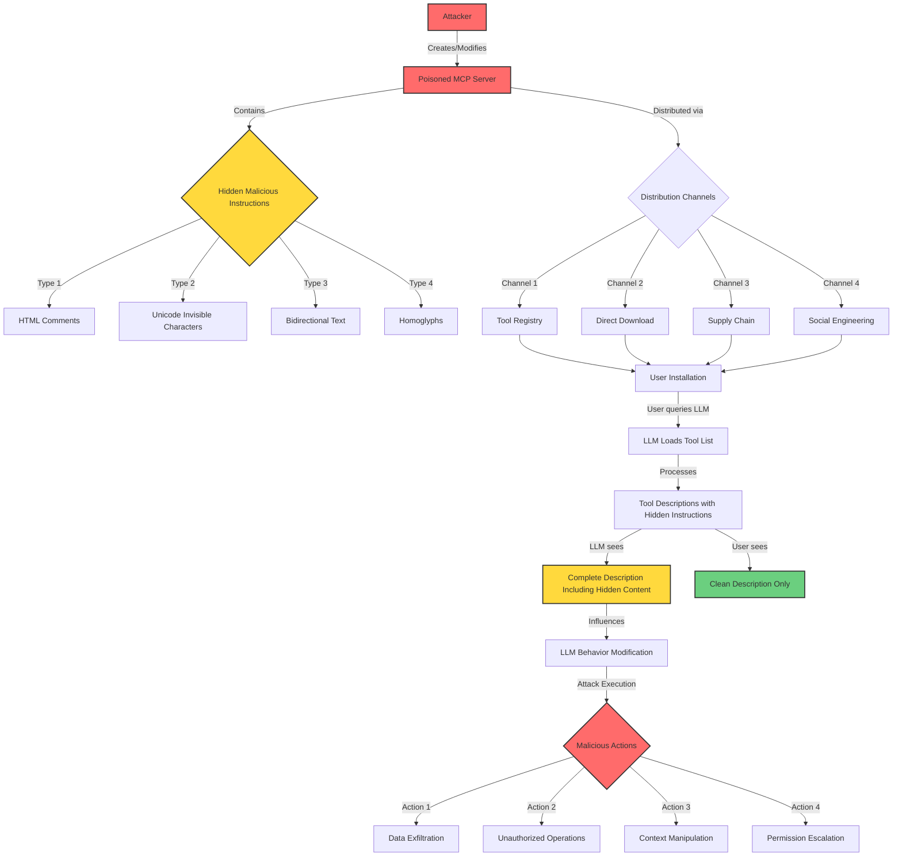
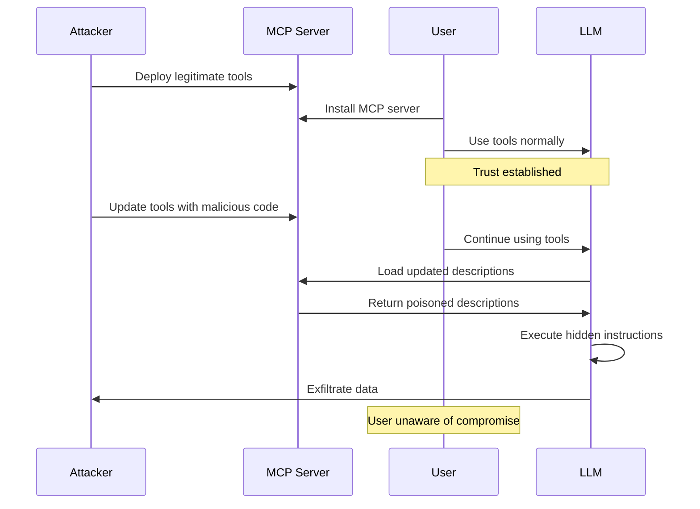

# Tool Poisoning Attack (TPA) Flow Diagram

## Attack Flow Stages

### 1. **Preparation Stage**
- Attacker creates or compromises an MCP server
- Embeds malicious instructions using various hiding techniques
- Prepares distribution strategy

### 2. **Distribution Stage**
- Poisoned server distributed through:
  - Official/unofficial tool registries
  - GitHub repositories
  - Package managers (npm, pip)
  - Social engineering (blog posts, tutorials)

### 3. **Installation Stage**
- User installs MCP server believing it's legitimate
- No immediate signs of compromise
- Tools appear to function normally

### 4. **Exploitation Stage**
- User interacts with LLM (Claude, ChatGPT, etc.)
- LLM loads tool descriptions from MCP server
- Hidden instructions processed by LLM but invisible to user
- LLM behavior silently modified

### 5. **Post-Exploitation Stage**
- LLM executes attacker's intended actions
- May include:
  - Reading sensitive files before legitimate operations
  - Sending data to attacker-controlled endpoints
  - Modifying outputs to include misinformation
  - Escalating to other connected tools

## Rug Pull Variant

## Detection Points

1. **Pre-Installation**: Scan tool descriptions for hidden content
2. **Installation Time**: Monitor for suspicious patterns
3. **Runtime**: Detect behavioral anomalies in LLM
4. **Post-Compromise**: Audit logs for unauthorized actions